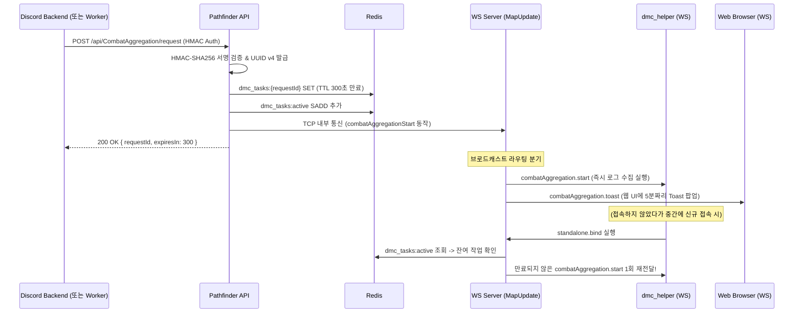

# Combat Aggregation Architecture (Pathfinder Backend)

이 문서는 전투 로그 집계(Combat Aggregation) 파이프라인 중 **패스파인더 백엔드 및 WebSocket 서버**의 역할을 설명합니다. 디스코드 봇(또는 외부 시스템)과 패스파인더, 그리고 클라이언트(`dmc_helper`, 웹 브라우저) 간의 통합 구조를 정의합니다.

## 전체 흐름 (Sequence)

## 핵심 컴포넌트

### 1. API Endpoint `POST /api/CombatAggregation/request`
- **위치**: `pathfinder/app/Controller/Api/CombatAggregation.php`
- **인증**: `.env`의 `DISCORD_TO_PF_HMAC` 키를 사용하여 요청 헤더 `X-Signature`의 HMAC-SHA256 검증 수행.
- **역할**: 
  - 외부의 수집 요청을 수락하고 UUID v4 형식의 고유 `requestId` 생성.
  - 클라이언트를 동기화할 만료 시간(`expiresIn: 300`) 세팅.
  - Redis에 작업 등록 후 WebSocket 서버에 TCP 신호 전송.

### 2. Redis Key 구조
- **`dmc_tasks:{requestId}`**: 각 수집 요청의 상세 데이터 보관. 300초(5분) TTL 설정으로 자동 만료.
  - 포맷: `{"requestId": "...", "startTime": "...", "endTime": "...", "createdAt": 1709...}`
- **`dmc_tasks:active`**: 현재 활성화 된 잔여 Task ID들을 추적하는 Redis SET.

### 3. WS Server (MapUpdate.php) 라우팅
- **위치**: `websocket/app/Component/MapUpdate.php`
- **`broadcastCombatAggregationStart`** 처리 분기:
  1. **dmc_helper (Standalone 연결)**: `combatAggregation.start` 이벤트를 발송. 만료 시간 생략 (즉시 실행 목적).
  2. **일반 브라우저 (Frontend 연결)**: `$browserConnections`로 추적된 대상들에게만 `combatAggregation.toast` 이벤트를 발송(`expiresIn` 포함).
- **`sendPendingDmcTasks`**: `dmc_helper`가 `standalone.bind`를 끝마칠 때, Redis SET에서 미완료된 Task를 즉시 꺼내와 1회 발송함으로써 유실 방지.

### 4. 웹 프론트엔드 수신부
- **워커 연동**: `pathfinder/js/app/worker/map.js` 내에서 서버의 `type` 필드를 `task`로 매핑하여 브로드캐스트.
- **UI 연동**: `pathfinder/js/app/mappage.js`의 `onGet` 내에서 `combatAggregation.toast`를 해석하여 **PNotify Toast**(전투 기록 집계 안내)를 출력.

## 상호 참조
- 클라이언트 로직 설계 및 세부 처리 내용은 `dmc_helper` 저장소의 `docs/combat_aggregation_architecture.md`를 참고하세요.
